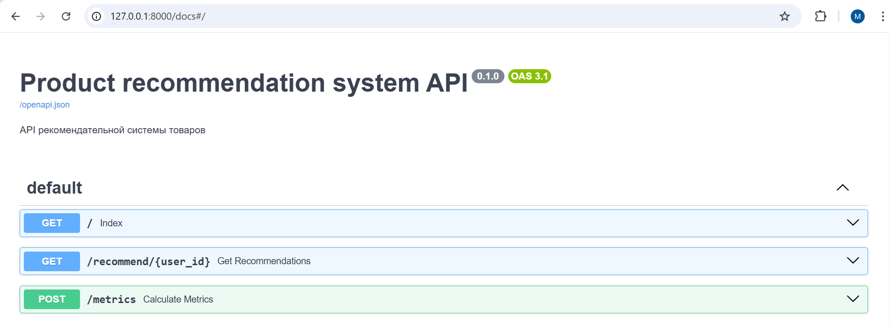

# Рекомендательная система товаров

## Постановка задачи

Данная задача (постановка + данные) предложена в курсе "ML Инженер" от [SkillFactory](https://skillfactory.ru).

Суть задачи в том, что нужно разработать рекомендательную систему товаров для некоторого маркетплейса.\
Система должна рекомедовать пользователю 3 товара, которые будут размещены на главной странице сайта.\
И цель состоит в том, чтобы повысить продажи на 20 %.

Поскольку данных о реальных взаимодействиях с товарами после внедрения системы у нас нет,\
мы будем оценивать техническую метрику $Precision@3$ на тестовой выборке.

> $Precision@3$ - это метрика $Precision$, взятая с отсечением первых трех рекомендаций.
>
> Если просто $Precision$ рассчитывается как:
>
> $$Точность \ рекомендательной \ системы \ (Precision): P = \frac{количество \ релевантных \ рекомендаций}{общее \ количество \ рекомендованных \ элементов}$$
>
> То:
>
> $$Precision@3 = \frac{количество \ релевантных \ рекомендаций \ из \ трех}{три \ рекомендованных \ товара} $$

Исходные данные содержат информацию:
- о взаимодействиях пользователей с товарами;
- обновления характеристик товаров за рассматриваемый промежуток времени;
- данные о вложенности категорий каталога товаров.

Подробное описание таблиц и построения системы находится в файле [./rec_sys/model_preparation/01_main.ipynb](./rec_sys/model_preparation/01_main.ipynb)

## Описание структуры проекта

- [rec_sys](./rec_sys/) - каталог содержит основной код для построения и запуска рекомендательной системы.
    - [app](./rec_sys/app/) - код приложения для обращения к системе по API.
        - содержимое вложенных папок `data` и `models` много весит, поэтому [вынесено отдельно](https://disk.yandex.ru/d/liEAshYKfBXRtg).
    - [model_preparation](./rec_sys/model_preparation/) - последовательный процесс построения системы.
    - [scripts](./rec_sys/scripts/) - скрипты (содержит 1 скрипт для демо подсчета метрик).
    - [utils](./rec_sys/utils/) - вспомогательные функции и константы.

- `data` - папка с таблицами в `csv`. \
Поскольку таблицы большие, то папка добавлена в `.gitignore`, а таблицы [вынесены отдельно](https://disk.yandex.ru/d/bolgDrQ-tNhobQ).

- [Makefile](./Makefile) - файл с командами для проекта. \
Вообще, данный формат изначально [задуман как самодокументируемый набор команд](https://ru.hexlet.io/blog/posts/makefile-as-task-runner).\
Поэтому ниже продублируем только некоторые из них.

## Инструкция по запуску

### Для запуска приложения из docker-образа

#### Получение 

```sh
# Скачать docker-образ
docker pull experiment0/product_recommendation_system:latest

# Если установлена утилита make, можно воспользоваться командой
make app-docker-pull
```

#### Запуск 

```sh
# Запустить приложение
docker run -p 8000:8000 --rm --name rec_sys_image experiment0/product_recommendation_system:latest 

# Если установлена утилита make, можно воспользоваться командой
make app-docker-run
```

Открыть в браузере страницу http://localhost:8000 . \
Приложение сделано с использованием `FastAPI` и `pydantic`. \
`FastAPI` автоматически генерирует документацию к созданному API,\
ее можно открыть в 2-х вариантах по ссылкам:
- http://localhost:8000/docs
- или http://localhost:8000/redoc

Там же из документации можно запустить тестовые запросы.\
Так выглядит документация по ссылке http://localhost:8000/docs



### Для локального запуска

1. Проверить, установлена ли утилита `uv`:
    ```sh
    uv --version
    ```
    Если не установлена, то нужно установить [по инструкции](https://docs.astral.sh/uv/getting-started/installation/#installation-methods).

2. Проверить, установлена ли утилита `make`:
    ```sh
    make --version
    ```
    Если не установлена, то установить на [windows](https://stackoverflow.com/questions/32127524/how-can-i-install-and-use-make-in-windows) или на [ubuntu](https://andreyex.ru/ubuntu/kak-ustanovit-make-na-ubuntu/).

3.
    ```sh
    # Клонировать проект
    git clone https://github.com/experiment0/product_recommendation_system.git

    # Перейти в папку с проектом
    cd product_recommendation_system

    # Установить зависимости
    make install
    ```

4. Скорировать модели и данные в соответствующие папки по ссылкам выше.

5. 
    Запустить локально приложение можно командой
    ```sh
    make start
    ```

    Открыть в браузере страницу http://localhost:8000 .\
    Документацию по апи так же, как и в случае с запуском через docker \
    можно открыть по ссылкам http://localhost:8000/docs или http://localhost:8000/redoc

    Запустить скрипт с демо подсчета метрик \
    (по первым 1000 записям из тестовой выборки)\
    можно командой:
    ```sh
    # Для linux
    make metrics

    # Для Windows
    make metrics-win
    ```

    Ответ с подсчитанными метриками в json выведется в консоль.